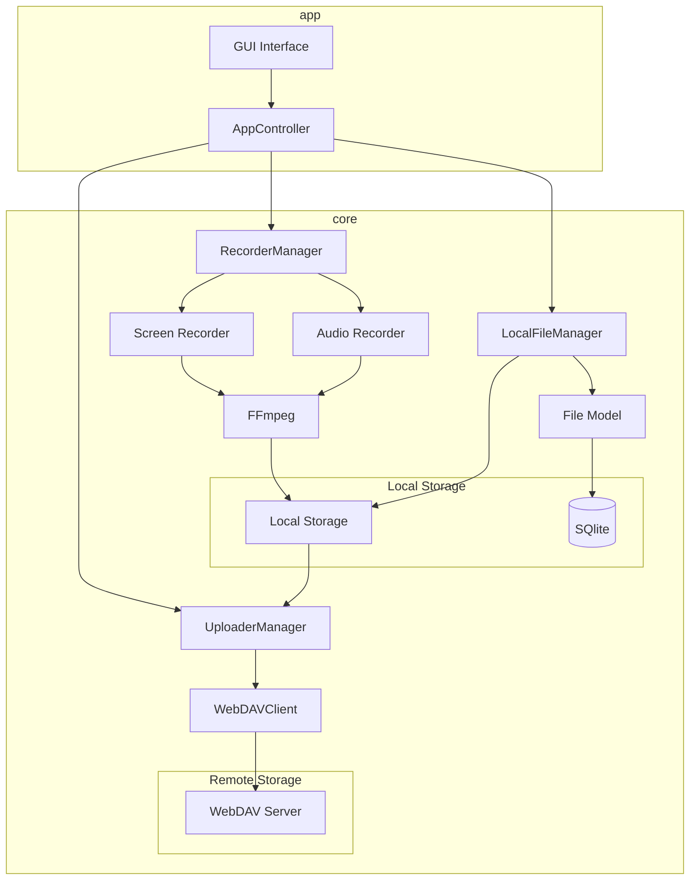
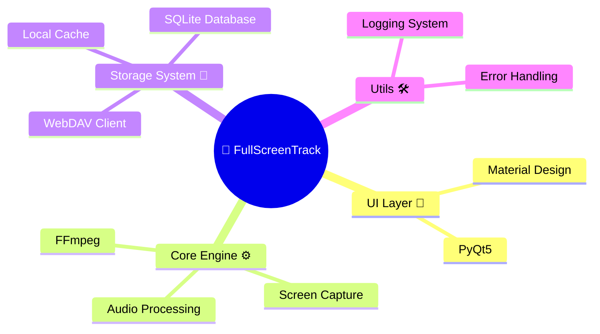
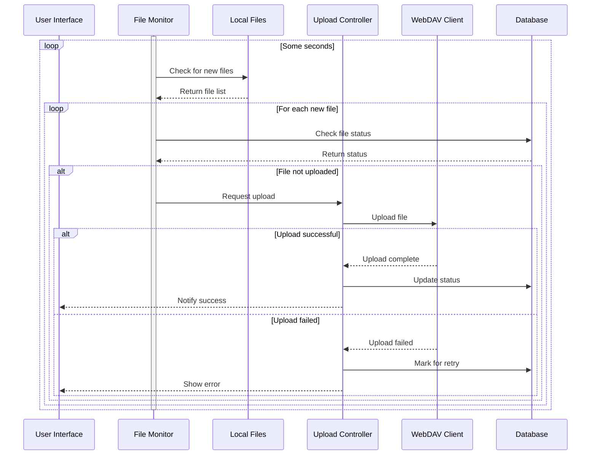
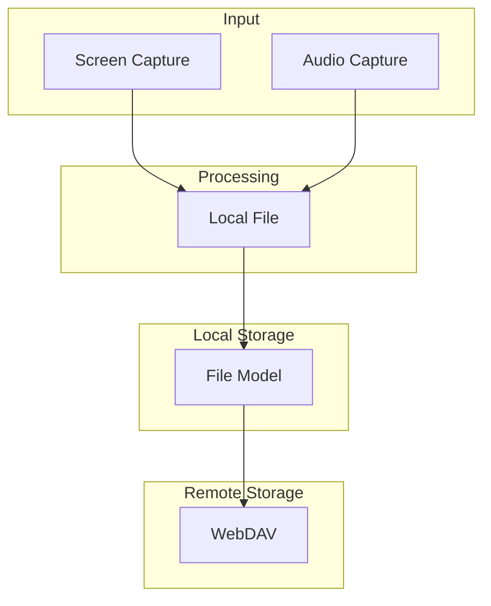

# 🎥 FullScreenTrack

<div align="center">


[](https://github.com/jeffzuo/full-screen-track/blob/main/LICENSE)
[](https://www.python.org/)
[](https://www.riverbankcomputing.com/software/pyqt/)
[](https://ffmpeg.org/)
[](https://material.io/design)
[](https://www.sqlite.org/)
[](https://github.com/jeffzuo/full-screen-track/releases)
[](https://makeapullrequest.com)

[🌎 English](README.md) | [🀄 简体中文](README_zh.md)

</div>

## ✨ Highlights

- 🎬 Screen recording
- 🔊 Aaudio recording
- 🌩️ WebDAV cloud sync
- 🎨 Modern Material Design interface
- 🖥️ Seamless multi-monitor support
- 📊 File management
- 🔒 Customized storage mode

## 📸 Gallery

<div align="center">

### 🖥️ Clean Interface


### 🔗 Functional File Management


### ⚙️ Configable


### 📊 Colorized Log Viewer


</div>

## 🏗️ System Architecture



## 💻 Tech Stack



## 📦 Quick Start

🔗 Download the latest release:
[Release Page](https://github.com/JeffZuo953/full-screen-track/releases)

### 🚀 Run from Release
1. Download the latest release from [Release Page](https://github.com/JeffZuo953/full-screen-track/releases)
2. Extract the zip file
3. Run `FullScreenTrack.exe`

### 🛠️ Development Setup
```bash
# Install development dependencies
pip install -r requirements-dev.txt

# Run with hot reload
python main.py
```

## 🔄 Workflow


## ⚡ Data Flow Architecture



## Star History

[](https://star-history.com/#JeffZuo953/full-screen-track&Date)

## 📄 License

This project is protected under the Apache License 2.0 - See [LICENSE](LICENSE) for details.

## 👥 Contributors

<table>
  <tr>
    <td align="center">
      <a href="https://github.com/JeffZuo953">
        
        <br />
        <sub><b>Jeff Zuo</b></sub>
      </a>
      <br />
      <sub>🎯 Project Lead</sub>
    </td>
  </tr>
</table>

## 📬 Get in Touch

- 📧 Email: jeffordszuo@gmail.com
- 🐱 GitHub: [@JeffZuo953](https://github.com/JeffZuo953)


<div align="center">

🌟 Made with ❤️ by Jeff Zuo 🌟

</div>