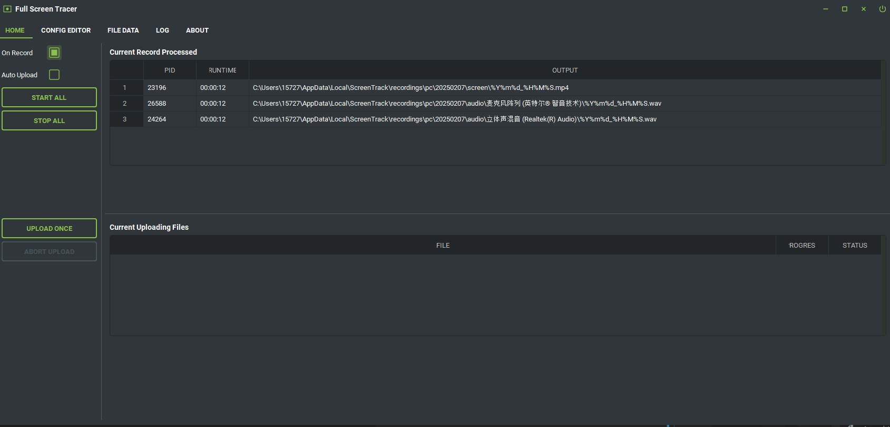
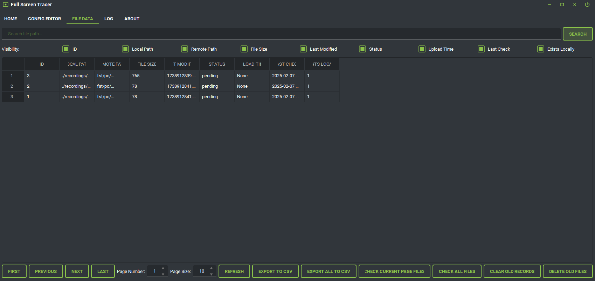
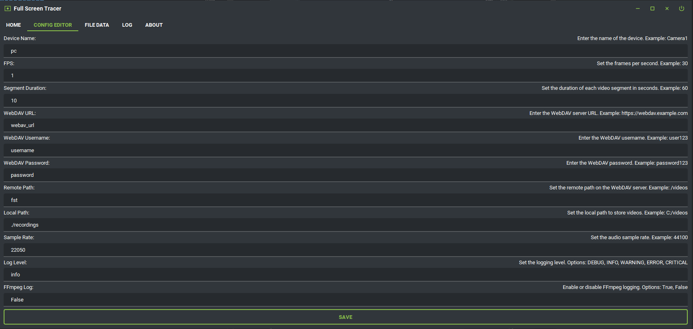
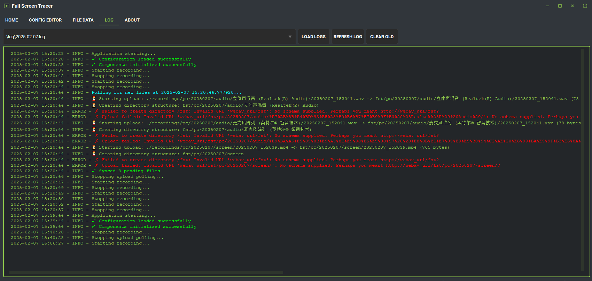
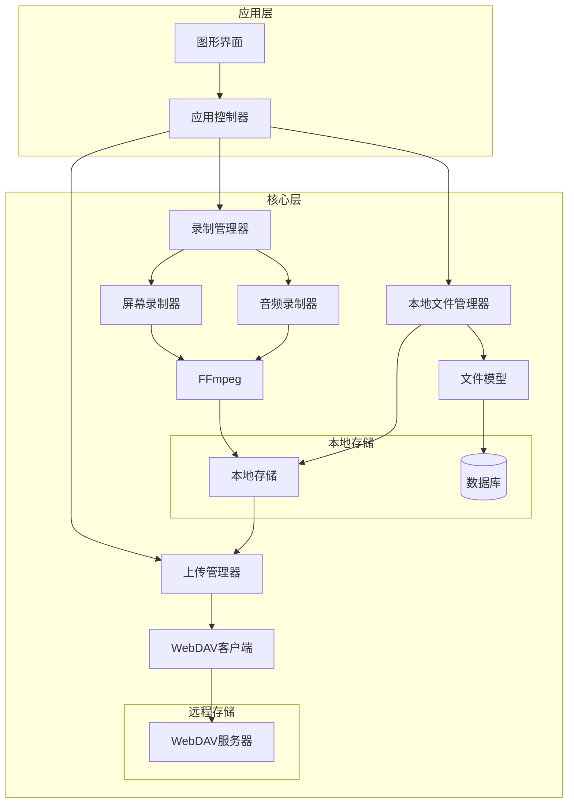
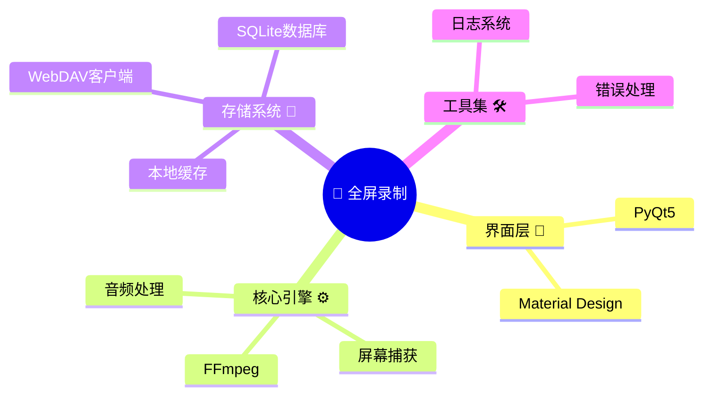
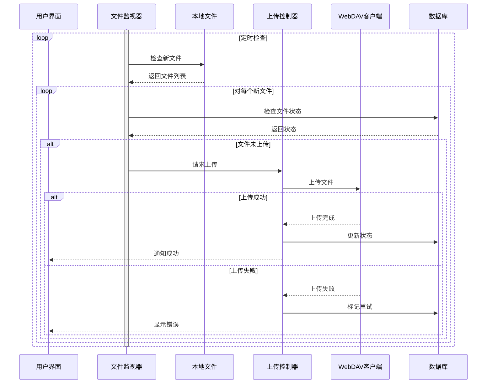
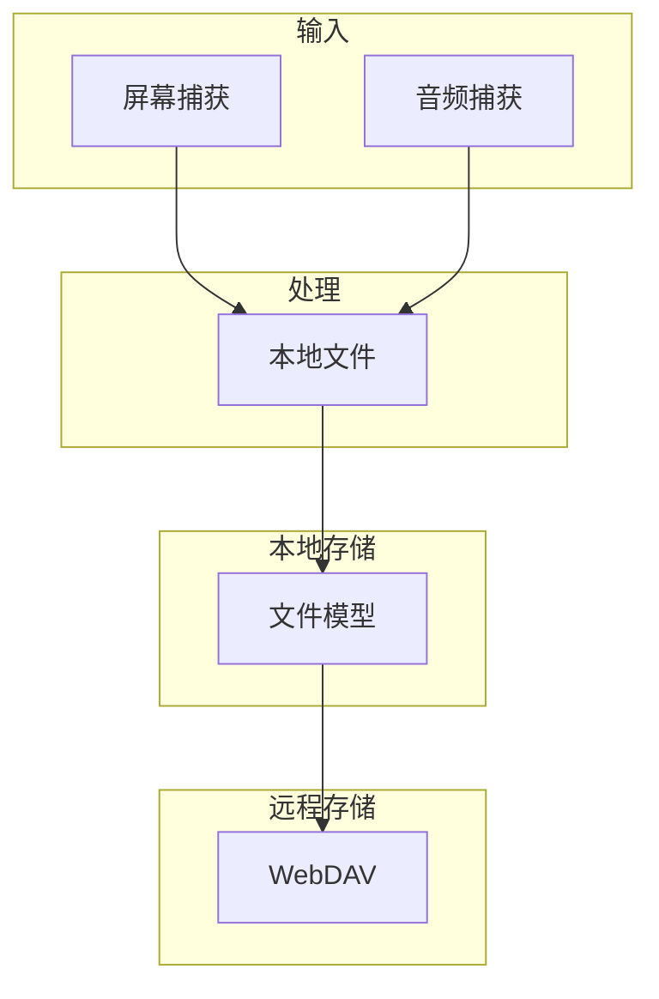

[🌎 English](README.md) | [🀄 简体中文](README_zh.md)

# 🤔 你是否遇到过这些情况？

- 📄 浏览器意外刷新，重要参考资料消失不见
- 🔍 找不到昨天查看过的文件或视频的位置
- ⚖️ 遇到劳动纠纷，需要可靠的工作记录证明
- 📊 月度考核时，难以量化工作成果
- 📝 远程会议结束后，遗漏重要细节
- 🎥 制作演示视频时，难以定位错误片段

## 😲 什么是 FullScreenTrack？

FullScreenTrack 是您的专业屏幕活动记录解决方案。它提供：

- 🎯 自动屏幕和音频录制
- 💾 智能本地存储管理
- ☁️ 安全云端同步
- 📊 全面活动日志
- 🔍 快速内容检索
- 🛡️ 数据备份保护


# 🎥 FullScreenTrack 全屏录制工具
<div align="center">


[](https://github.com/jeffzuo/full-screen-track/blob/main/LICENSE)
[](https://www.python.org/)
[](https://www.riverbankcomputing.com/software/pyqt/)
[](https://ffmpeg.org/)
[](https://material.io/design)
[](https://www.sqlite.org/)
[](https://github.com/jeffzuo/full-screen-track/releases)
[](https://makeapullrequest.com)


</div>


无论您是需要记录工作的专业人士，保持工作透明度的远程工作者，还是需要可靠屏幕录制的内容创作者 - FullScreenTrack 都能满足您的需求。

## ✨ 主要特性

- 🎬 专业的屏幕录制功能
- 🔊 高质量音频采集
- 🌩️ WebDAV云端同步
- 🎨 现代化Material Design界面
- 🖥️ 完善的多显示器支持
- 📊 智能文件管理系统
- 🔒 安全可靠的存储方案
- ⚡ 高性能低资源占用

## 📸 界面展示

<div align="center">

### 🖥️ 简洁的主界面


### 🔗 功能完备的文件管理


### ⚙️ 丰富的配置选项


### 📊 彩色日志查看器


</div>

## 🏗️ 系统架构



## 💻 技术栈



## 📦 快速开始

🔗 下载最新版本：
[下载页面](https://github.com/JeffZuo953/full-screen-track/releases)


### 🚀 运行发布版本
1. 从[发布页面](https://github.com/JeffZuo953/full-screen-track/releases)下载最新版本
2. 解压缩文件
3. 运行 `FullScreenTrack.exe`

### 🛠️ 开发环境配置
```bash
# 安装开发依赖
pip install -r requirements-dev.txt

# 使用热重载运行
python main.py
```


## 🔄 工作流程



## ⚡ 数据流架构



## ⭐ 项目活跃度

[](https://star-history.com/#JeffZuo953/full-screen-track&Date)


## 📄 开源协议

本项目采用 Apache License 2.0 协议 - 详情请查看 [LICENSE](LICENSE) 文件

## 👥 贡献者

<table>
  <tr>
    <td align="center">
      <a href="https://github.com/JeffZuo953">
        
        <br />
        <sub><b>Jeff Zuo</b></sub>
      </a>
      <br />
      <sub>🎯 项目负责人</sub>
    </td>
  </tr>
</table>

## 📬 联系方式

- 📧 邮箱: jeffordszuo@gmail.com
- 🐱 GitHub: [@JeffZuo953](https://github.com/JeffZuo953)

<div align="center">

🌟 由 Jeff Zuo 用 ❤️ 精心打造 🌟

</div>
